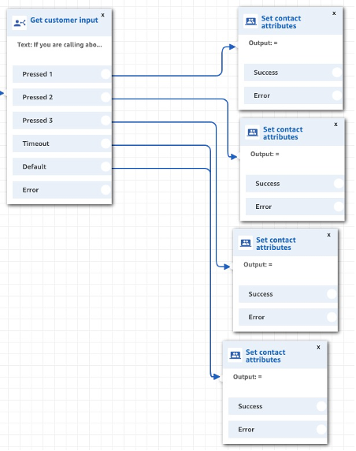
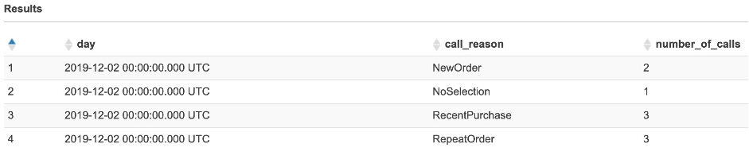
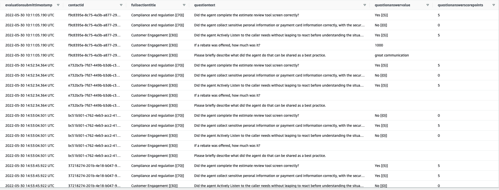
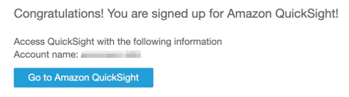

# Amazon Connect Data Analytics Sample

Amazon Connect Data Analytics Sample solution enables you to get started with enabling advanced, end-to-end reporting
for Amazon Connect contact centre, by processing and querying a collection of data sources with different record
structures. The sample solution leverage Amazon Connect with other AWS services to create a unified data repository,
then drill down into the details by using Amazon Athena, and leverage Amazon QuickSight business intelligence service to
easily create and publish analytical dashboards to your business owners. Amazon Connect Data Analytics Sample doesn't
require any additional servers and/or databases, and keeps the operational cost as low as possible.

## Amazon Connect data streaming

Amazon Connect is a cloud-based contact center service which makes it easy to set up and manage a customer contact
center and provide reliable customer engagement at any scale. You can deploy a contact center in just a few steps,
onboard agents from anywhere, and begin to engage with your customers.

Within Amazon Connect, you can generate a number of real-time and historical reports and dashboards, to monitor
efficiency and utilization, agent performance, and other metrics related to your contact centre. The built-in reports
and dashboards can be customized by setting filters, groupings, and by selecting specific metrics to be displayed on the
screen. More information about built-in metrics can be found in the official documentation:  
[Real-time metrics](https://docs.aws.amazon.com/connect/latest/adminguide/real-time-metrics-reports.html)  
[Historical metrics](https://docs.aws.amazon.com/connect/latest/adminguide/historical-metrics.html)

### Amazon Connect Contact Trace Records (CTR)

Please note that Contact Trace Records (CTR) were renamed to Contact Records (CR) in Amazon Connect. This implementation
will still refer to them as CTRs.

The basis for most historical and real-time metrics in Amazon Connect is the data in the Contact Trace Records (CTR).
CTRs are available within your instance for 24 months from the time at which the associated contact was initiated.

Besides built-in metrics, you can also stream CTRs to Amazon Kinesis, so that you can manage retention and perform
advanced analysis on the data for your contact centre.

CTR data is streamed in JSON format and each CTR has information about individual contacts. For example, this
information might include the start and end time of a call, which agent handled the call, which queue was chosen, queue
wait times, number of holds, and so on. Each Contact in Amazon Connect produces one or more CTRs (i.e. contact transfers
produce a CTR for each segment of the Contact).

CTR data model can be found in the
official [documentation](https://docs.aws.amazon.com/connect/latest/adminguide/ctr-data-model.html)

Amazon Connect Data Analytics Sample solution stores CTR data into Amazon S3, then use other AWS services, such as
Amazon Athena and Amazon QuickSight, to query and visualize the data. The architecture for CTR streaming is given on the
following diagram.


### Amazon Connect Agent Events (AE)

Amazon Connect Agent Event Streams are Amazon Kinesis data streams that provide you with near real-time reporting of
agent activity within your Amazon Connect instance. The events published to the stream include agent login, agent
logout, agent connects with a contact, and agent status change.

Agent event streams are created in JavaScript Object Notation (JSON) format. For each event type, a JSON blob is sent to
the Kinesis data stream. The following event types are included in agent event streams:

- LOGIN — An agent login to the contact centre
- LOGOUT — An agent logout from the contact centre
- STATE_CHANGE — One of the following changed:
	- Agent configuration, such as profile or the assigned hierarchy group
	- Agent state in the contact control panel, such as Available
	- Agent conversation state, such as on hold
- HEART_BEAT — This event is published every 120 seconds if there are no other events published during that interval

Agent Events (AE) data model can be found in the
official [documentation](https://docs.aws.amazon.com/connect/latest/adminguide/agent-event-stream-model.html)

Amazon Connect Data Analytics Sample solution stores AE data into Amazon S3, then use other AWS services, such as Amazon
Athena and Amazon QuickSight, to query and visualize the data. The architecture for AE streaming is given on the
following diagram.


### Amazon Connect Contact Flow Logs (CFL)

Amazon Connect Contact Flow Logs provide you with near real-time details about events in your Contact Flows, as
customers interact with them. You can use contact flow logs to help debug your Contact Flows as you are creating them.

After you publish your Contact Flows, you can view the logs to gain insight into what happens during complex Contact
Flows, and quickly identify errors that your customers encounter when they connect to your contact centre. If needed,
you can always roll back to a previous version of a Contact Flow.

Contact Flow Logs are stored in Amazon CloudWatch, in the same region as your Amazon Connect instance. A log entry added
as each block in your contact flow is triggered. You can configure CloudWatch to send alerts when unexpected events
occur during active contact flows. As a contact centre manager, you can aggregate data from Contact Flow Logs to analyze
performance of Contact Flows to optimize the experience you provide for your customers.

Log entries for Contact Flows include details about the block associated with the log entry, the contactId, and the
action taken after the steps in the block were completed. Any contact interaction that occurs outside of the Contact
Flow is not logged, such as time spent in a queue or interactions with an agent.

You can control which data is captured in Contact Flow Logs by including a `Set logging behavior` block in your Contact
Flow. You can set the properties of the block to disable logging during the parts of your Contact Flow that interact
with or capture sensitive data or customers’ personal information.

If you use Amazon Lex or AWS Lambda in your Contact Flows, the logs show the entry and exit of the contact flow going to
them, and include any information about the interaction that is sent or received during entry or exit.

More information can be found in the
official [documentation](https://docs.aws.amazon.com/connect/latest/adminguide/contact-flow-logs.html)

Amazon Connect Data Analytics Sample solution stores Contact Flow Logs (CFL) into Amazon S3, then use other AWS
services, such as Amazon Athena and Amazon QuickSight, to query and visualize the data. The architecture for CFL
streaming is given on the following diagram.


### Amazon Connect Contact Lens (CL)

Contact Lens for Amazon Connect, a feature of Amazon Connect, helps you follow the sentiment and trends of customer
conversations in real time to identify crucial company and product feedback. You can also track the agent compliance of
customer conversations in your contact center to ensure standard greetings and sign-offs are used, help train agents,
and replicate successful interactions. Supervisors can conduct fast full-text search on all transcripts to quickly
troubleshoot customer issues. Using real-time analytics powered by machine learning (ML), you can also get alerted to
issues during live customer calls and deliver coaching to agents while calls are in progress, improving customer
satisfaction.

Contact Lens for Amazon Connect provides both real-time and post-call analytics of customer-agent conversations.

- **Real-time analytics**: Use to detect and resolve customer issues more proactively while the call is progress. For
	example, it can analyze and alert you when a customer is getting frustrated because the agent is unable to resolve a
	complicated problem. This allows you to provide assistance proactively.
- **Post-call analytics**: Use to understand trends of customer conversations, and agent compliance. This helps you
	identify opportunities to coach an agent after the call.

More information can be found in the
official [documentation](https://docs.aws.amazon.com/connect/latest/adminguide/analyze-conversations.html)

Amazon Connect Data Analytics Sample utilizes Contact Lens **Post-call analytics** metadata output files.  
The output files generated by Contact Lens include metadata such as call transcript, sentiment analysis, non-talk time,
categorization labels, talk speed, interruptions etc. Contact Lens stores metadata output files in the Amazon Connect
Call Recording S3 bucket.

More information about Contact Lens output files can be found in the
official [documentation](https://docs.aws.amazon.com/connect/latest/adminguide/contact-lens-example-output-files.html)

For Contact Lens output files processing, Amazon Connect Data Analytics Sample requires enabling Amazon EventBridge
notification on Amazon Connect Call Recording S3 bucket. Once Amazon S3 Event Notifications to Amazon EventBridge is
enabled, Amazon S3 can send events to Amazon EventBridge whenever certain events happen in Amazon Connect Call Recording
S3 bucket. You can find more information about Amazon S3 Event Notifications in the
official [documentation](https://docs.aws.amazon.com/AmazonS3/latest/userguide/EventBridge.html). Enabling Amazon
EventBridge notifications can also be found in the
official [documentation](https://docs.aws.amazon.com/AmazonS3/latest/userguide/enable-event-notifications-eventbridge.html).

The architecture for Contact Lens output files processing is given on the following diagram.


1. Once a voice contact, with enabled Contact
	 Lens ([documentation](https://docs.aws.amazon.com/connect/latest/adminguide/enable-analytics.html)) completes,
	 Contact Lens runs the analysis job, and exports Contact Lens output file to Amazon Connect Call Recording S3 bucket
1. Amazon S3 sends a notification event to Amazon Event Bridge
1. Amazon EventBridge
	 Rule (`source: ['aws.s3']`, `detailType: ['Object Created']`, `detail.object: { key: [{ prefix: 'Analysis/Voice/' }] }`, `detail.reason: ['PutObject']`)
	 triggers `CLEventProcessorLambda` function
1. `CLEventProcessorLambda`  function checks the file path and name, using a Regular
	 Expression (`/^Analysis\/Voice\/\d{4}\/\d{2}\/\d{2}\/[a-z0-9]{8}-[a-z0-9]{4}-[a-z0-9]{4}-[a-z0-9]{4}-[a-z0-9]{12}_analysis_\d{4}-\d{2}-\d{2}T\d{2}:\d{2}:\d{2}Z.json/`)
	 since we only need the "Original analyzed transcript file" (rather than "Redacted analyzed transcript file" or "
	 Redacted audio file")
1. In case the file path and name were valid, `CLEventProcessorLambda` function sends a message, containing `s3Bucket`
	 and `s3ObjectKey`, to `CLOutputFileLoaderQueue`
1. `CLOutputFileLoaderLambda` function gets triggered by message(s) from `CLOutputFileLoaderQueue`
1. `CLOutputFileLoaderLambda` function gets Contact Lens output file (JSON) from Amazon Connect Call Recording S3
	 bucket, based on received `s3Bucket` and `s3ObjectKey`
1. `CLOutputFileLoaderLambda` function extracts metadata such as:

	- `contactId`
	- `instanceId`
	- `recordingTimestamp`
	- `channel`
	- `languageCode`
	- `matchedCategories`
	- `totalConversationDuration`
	- `overallSentimentAgent`
	- `overallSentimentCustomer`
	- `interruptionsTotalCount`
	- `nonTalkTimeTotal`
	- `averageWordsPerMinuteAgent`
	- `averageWordsPerMinuteCustomer`
	- `talkTimeTotal`
	- `talkTimeAgent`
	- `talkTimeCustomer`

1. `CLOutputFileLoaderLambda` function also processes the Contact Lens Transcript to extract `callSummary` metadata,
	 such as:

	- `issuesDetectedCount`
	- `actionItemsDetectedCount`
	- `outcomesDetectedCount`

1. You can see, and customize the metadata extraction process, by opening (and
	 modifying) `cdk-stacks/lambdas/services/ContactLensService.js` -> `extractContactLensDetails`
	 and `extractCallSummary` functions
1. Once the extraction is completed, `CLOutputFileLoaderLambda` function sends a message, containing
	 extracted `contactLensDetails`, to `CLRecordWriterQueue`
1. `CLRecordWriterLambda` function gets triggered by message(s) from `CLRecordWriterQueue`
1. `CLRecordWriterLambda` functions writes received `contactLensDetails` to Amazon Kinesis Firehose (CL)
1. Amazon Kinesis Firehose (CL) delivers records to Amazon S3 bucket (CL), in JSON format

### Amazon Connect Evaluation Forms (EF)

Amazon Connect provides a set of agent performance management capabilities, that make it easy for contact center users
to assess, track, and improve how agents interact with customers and resolve issues. Amazon Connect provides users with
the ability to build Evaluation Forms that they use to evaluate how agents perform when interacting with customers. This
helps them to provide feedback and help agents deliver better customer experiences.

Amazon Connect enables customers to define custom Evaluation Forms, using Amazon Connect Console (UI), allows them to
start evaluations manually, in Contact Details page. The output of the evaluations is delivered to Amazon Connect Call
Recording S3 bucket, in JSON format. The Evaluation Forms output files can be ingested into custom evaluation scoring
pipelines, and be used to perform advanced reporting and analysis.

For Evaluation Forms output files processing, Amazon Connect Data Analytics Sample requires enabling Amazon EventBridge
notification on Amazon Connect Call Recording S3 bucket. Once Amazon S3 Event Notifications to Amazon EventBridge is
enabled, Amazon S3 can send events to Amazon EventBridge whenever certain events happen in Amazon Connect Call Recording
S3 bucket. You can find more information about Amazon S3 Event Notifications in the
official [documentation](https://docs.aws.amazon.com/AmazonS3/latest/userguide/EventBridge.html). Enabling Amazon
EventBridge notifications can also be found in the
official [documentation](https://docs.aws.amazon.com/AmazonS3/latest/userguide/enable-event-notifications-eventbridge.html).

The architecture for Evaluation Forms output files processing is given on the following diagram.


1. Once a contact is evaluated (using a published Evaluation Form), an Evaluation Forms output file is exported to
	 Amazon Connect Call Recording S3 bucket
1. Amazon S3 sends a notification event to Amazon EventBridge
1. Amazon EventBridge
	 Rule (`source: ['aws.s3']`, `detailType: ['Object Created']`, `detail.object: { key: [{ prefix: 'Evaluations/' }] }`, `detail.reason: ['PutObject']`)
	 triggers `EFEventProcessorLambda` function
1. In case the file path and name were valid, `EFEventProcessorLambda` function sends a message, containing `s3Bucket`
	 and `s3ObjectKey`, to `EFOutputFileLoaderQueue`
1. `EFOutputFileLoaderLambda` function gets triggered by message(s) from `EFOutputFileLoaderQueue`
1. `EFOutputFileLoaderLambda` function gets Evaluation Forms output file (JSON) from Amazon Connect Call Recording S3
	 bucket, based on received `s3Bucket` and `s3ObjectKey`
1. `EFOutputFileLoaderLambda` function processes the Evaluation Forms Questions and Answers
1. Once the extraction is completed, `EFOutputFileLoaderLambda` function sends a message, containing
	 extracted `evaluationFormDetails`, to `EFRecordWriterQueue`
1. `EFRecordWriterLambda` function gets triggered by message(s) from `EFRecordWriterQueue`
1. `EFRecordWriterLambda` functions writes received `evaluationFormDetails` to Amazon Kinesis Firehose (EF)
1. Amazon Kinesis Firehose (EF) delivers records to Amazon S3 bucket (EF), in JSON format

## Automated data partitions loading

### Amazon Athena

Amazon Athena is an interactive query service that makes it easy to analyze data in Amazon S3 using standard SQL. Athena
is serverless, so there is no infrastructure to manage, and you pay only for the queries that you run.

Athena is easy to use. We can simply point Athena to Amazon Connect data in Amazon S3, define the schema, and start
querying using standard SQL. Amazon Athena allows you to tap into all your data in S3 without the need to set up complex
processes to extract, transform, and load the data (ETL).

Amazon Athena provides ODBC/JDBC driver, allowing you to explore and visualize your data with business intelligence
tools of your choice.

Amazon Connect Data Analytics Sample solution data querying architecture is given in the diagram below.


### AWS Glue

AWS Glue is fully managed Extract, Transform, and Load (ETL) service that makes it easy for customers to prepare and
load their data for analytics. You simply point AWS Glue to your data stored on AWS, and AWS Glue discovers your data
and stores the associated metadata (e.g. table definition, schema and partitions) in the AWS Glue Data Catalog. Once
catalogued, your data is immediately searchable, queryable, and available for ETL.

AWS Glue crawlers connect to your source or target data store, progresses through a prioritized list of classifiers to
determine the schema for your data, and then creates metadata in your AWS Glue Data Catalog. The metadata is stored in
tables in your data catalog and used in the authoring process of your ETL jobs. You can run crawlers on a schedule,
on-demand, or trigger them based on an event to ensure that your metadata is up-to-date.

With AWS Glue, you pay an hourly rate, billed by the second, for crawlers (discovering data) and ETL jobs (processing
and loading data). For the AWS Glue Data Catalog, you pay a simple monthly fee for storing and accessing the metadata.
The first million objects stored are free, and the first million accesses are free.

There is an hourly rate for AWS Glue crawler runtime to discover data and populate the AWS Glue Data Catalog. You are
charged an hourly rate based on the number of Data Processing Units (or DPUs) used to run your crawler. A single Data
Processing Unit (DPU) provides 4 vCPU and 16 GB of memory. You are billed in increments of 1 second, rounded up to the
nearest second, with a 10-minute minimum duration for each crawl. Use of AWS Glue crawlers is optional, and you can
populate the AWS Glue Data Catalog directly through the API.

More information about Glue pricing can be found in the official [documentation](https://aws.amazon.com/glue/pricing/)

When an AWS Glue crawler scans Amazon S3 and detects multiple folders in a bucket, it determines the root of a table in
the folder structure and which folders are partitions of a table. The name of the table is based on the Amazon S3 prefix
or folder name. You provide an Include path that points to the folder level to crawl. When the majority of schemas at a
folder level are similar, the crawler creates partitions of a table instead of two separate tables. To influence the
crawler to create separate tables, add each table's root folder as a separate data store when you define the crawler.

### Data partitioning

**Partitioning** has emerged as an important technique for organizing datasets so that they can be queried efficiently
by a variety of big data systems. Data is organized in a hierarchical directory structure based on the distinct values
of one or more columns.

Amazon Connect Data Analytics Sample solution partitions Amazon Connect CTR, AE, CFL, CL, and EF data in Amazon S3 by
date - broken down by year, month, and day. Files corresponding to a single day’s worth of data would then be placed
under a prefix, such as:
`s3://ctr_bucket/fhbase/year=2022/month=04/day=28/`

Amazon Athena can use these partitions to filter data by value, without making unnecessary calls to Amazon S3. This can
significantly improve the performance of applications that need to read only a few partitions.

As explained above, we could set up a crawler to automatically scan our partitioned dataset and load partitions in the
Data Catalog, but that can get expensive, and it might not be a necessary step for strongly defined schemas, such as
Amazon Connect CTR, AE, CFL, CL, and EF. Instead of crawling the data each time, we can load new partitions into
existing tables, by invoking the Addition method, on a daily basis.

For Amazon Athena, there are no charges for Data Definition Language (DDL) statements like CREATE/ALTER/DROP TABLE,
statements for managing partitions, or failed queries. More information about Athena pricing can be found in the
official [documentation](https://aws.amazon.com/athena/pricing/)

### Athena Partitioning State Machine

Amazon Connect Data Analytics Sample solution creates CTR, AE, CFL, CL, and EF (AWS Glue) tables, and configures Amazon
Firehose to deliver data to S3 in partitions (folders), a workflow is required to load new partitions into existing
tables, on a daily basis. For that purpose, AWS Step Functions state machine is deployed, to orchestrate a set of Lambda
functions, which add new partitions, each day, just before midnight. This way, our Catalog will always have all
partitions needed for our advanced reporting and data analytics.


1. The workflow starts with `PartitioningConfigureCount` step, which sets Iterator to 10
1. In the next step, the `PartitioningIteratorTask` is checked, and if 10 retries
	 reached (`PartitioningIsCountReached`), the workflow terminates through `PartitioningQueryFailed` step
1. Otherwise, the `StartPartitioningTask` step invokes `StartPartitioningLambda` function
1. `StartPartitioningLambda` is in charge to load a partition into the Glue Catalog

	- Input parameters to AthenaJobStart Lambda function:
		- `s3_bucket` – set to CTR/AE/CFL/CL/EF bucket name
		- `s3_prefix` – set to `fhbase`, based on prefix set by Firehose
		- `table_name` – set to CTR/AE/CFL/CL/EF table name
		- `overridePartitionLoad` – set to false by default
	- By default, the workflow is scheduled at 11:45pm (UTC), every day
	- The function gets the current date, and adds 1 day, then checks if that path exists in the `s3_bucket/s3_prefix`.
		For instance, if the function was run on 2022/04/27 at 23:45, the function would add 1 day and check
		if `s3_bucket/s3_prefix/fhbase/year=2019/month=11/day=28` exists in CTR/AE/CFL/CL/EF S3 bucket.
	- If the path does not exist, which is expected if the function was run before midnight, the new S3 ‘folder’ is
		created
	- Otherwise, if the path exists, which means that function was run after the midnight, due to a failure, or due to a
		manual run, it would proceed to a next step without creating the new S3 ‘folder’
	- Once the new partition path is present in `s3_bucket`, the function executes an Athena query:  
		`ALTER TABLE table_name ADD IF NOT EXISTS PARTITION (year=2022, month=04, day=28) location ‘s3://s3_bucket/s3_prefix/ year=2022/month=04/day=28’`
	- Athena responses with a `QueryExecutionId` and the function terminates

1. In the `PollPartitioningStatusTask` step, `PollPartitioningStatusLambda` function is invoked, to check the status of
	 the current query, based on `QueryExecutionId`
1. `PartitioningWaitNext` and `PartitioningCheckComplete` are creating a loop, and invoke `PollPartitioningStatusLambda`
	 until the query completes
1. Once query is completed, the `GetPartitioningResultTask` step invokes `GetPartitioningResultsLambda` function, which
	 terminates the workflow.

### Athena Partitioning schedules

Amazon Connect Data Analytics Sample solution creates Amazon EventBridge rules that run on a daily schedule, for each
AWS Glue table

- `CtrPartitioningSchedule` - Executes CTR partitioning job (Step Functions) on a daily basis (`cron(45 23 ? * * *)')`)
	for `connect_ctr` table
- `AePartitioningSchedule` - Executes AE partitioning job (Step Functions) on a daily basis (`cron(45 23 ? * * *)')`)
	for `connect_ae` table
- `CflPartitioningSchedule` - Executes CFL partitioning job (Step Functions) on a daily basis (`cron(45 23 ? * * *)')`)
	for `connect_cfl` table
- `CLPartitioningSchedule` - Executes CL partitioning job (Step Functions) on a daily basis (`cron(45 23 ? * * *)')`)
	for `connect_cl` table
- `EFPartitioningSchedule` - Executes EF partitioning job (Step Functions) on a daily basis (`cron(45 23 ? * * *)')`)
	for `connect_ef` table

### Load Athena partitions manually

It might happen that you would need to load your partitions manually. That can be done:

1. From Amazon Athena Console, select a table and click **Load partitions**
1. From Amazon Athena Console, run: `MSCK REPAIR TABLE "table_name"`
1. From AWS Step Functions Console, manually by overriding the partition path (recommended)

Both methods from Amazon Athena Console would force a data scan, trying to identify new partitions in the S3 bucket,
inquiring additional cost. As explained previously, adding new partition by providing the exact path, would be more
efficient and cost effective (3rd option).

To run your Step Functions manually, follow these steps:

1. Open your AWS Console and navigate to Step Functions
1. In the State machines list, select `AthenaPartitioningStateMachine`
1. In the **Executions** section, click **Start execution**
1. In the `Input – optional` text box, provide the JSON payload to be passed as the input for the manual execution. For
	 instance, to manually load 29th of April 2022, use one of the following:

	- Contact Trace Records (CTR) example:
		```json
		{
		"s3_bucket": "amazonconnectdataanalyticssample-ctr-account-region",
		"s3_prefix": "fhbase",
		"table_name": "amazonconnectdataanalyticsdb.connect_ctr",
		"overridePartitionLoad": "year=2022/month=04/day=29/"
		}
		```
	- Agent Events (AE) example:
		```json
		{
		"s3_bucket": "amazonconnectdataanalyticssample-ae-account-region",
		"s3_prefix": "fhbase",
		"table_name": "amazonconnectdataanalyticsdb.connect_ae",
		"overridePartitionLoad": "year=2022/month=04/day=29/"
		}
		```
	- Contact Flow Logs (CFL) example:
		```json
		{
		"s3_bucket": "amazonconnectdataanalyticssample-cfl-account-region",
		"s3_prefix": "fhbase",
		"table_name": "amazonconnectdataanalyticsdb.connect_cfl",
		"overridePartitionLoad": "year=2022/month=04/day=29/"
		}
		```
	- Contact Lens (CL) example:
		```json
		{
		"s3_bucket": "amazonconnectdataanalyticssample-cl-account-region",
		"s3_prefix": "fhbase",
		"table_name": "amazonconnectdataanalyticsdb.connect_cl",
		"overridePartitionLoad": "year=2022/month=04/day=29/"
		}
		```
	- Evaluation Forms (EF) example:
		```json
		{
		"s3_bucket": "amazonconnectdataanalyticssample-ef-account-region",
		"s3_prefix": "fhbase",
		"table_name": "amazonconnectdataanalyticsdb.connect_ef",
		"overridePartitionLoad": "year=2022/month=04/day=29/"
		}
		```

1. In `s3_bucket` parameter, update `account` and `region` from your environment
1. Then click on the **Start execution**

You can monitor an execution of AWS Step Functions State Machine, and once the execution is completed, test the results
by querying your data in Amazon Athena, for the particular date.

## Solution components

On a high level, the solution consists of the following 6 stacks:

- `partitioning-stack` - with all the resources needed for automated Athena
	partitioning (`AthenaResultsS3bucket`, `StartPartitioningLambda`, `PollPartitioningStatusLambda`, `GetPartitioningResultsLambda`, `PartitioningIteratorLambda`, `AthenaPartitioningStateMachine`)
- `ctr-stack` - with all the resources needed for Amazon Connect Contact Trace Record (CTR) streaming and
	processing (`CtrS3bucket`, `CTRKinesisStream`, `CtrKinesisFirehose`, `CtrGlueTable`, `CtrPartitioningSchedule`)
- `ae-stack` - with all the resources needed for Amazon Connect Agent Events (AE) streaming and
	processing (`AES3bucket`, `AEKinesisStream`, `AEKinesisFirehose`, `AEGlueTable`, `AePartitioningSchedule`)
- `cfl-stack` - with all the resources needed for Amazon Connect Contact Flow Logs (CFL) streaming and
	processing (`CflS3bucket`, `KinesisFirehoseCloudwatchLogsProcessorLambda`, `CflKinesisFirehose`, `CflSubscriptionFilter`, `CflGlueTable`, `CflPartitioningSchedule`)
- `cl-stack` - with all the resources needed from Amazon Connect Contact Lens (CL) output files
	processing (`CLS3bucket`, `CLKinesisFirehose`, `CLGlueTable`, `ConnectCLS3BucketNotificationRule`, `CLEventProcessorLambda`, `CLOutputFileLoaderQueue`, `CLOutputFileLoaderLambda`, `CLRecordWriterQueue`, `CLRecordWriterLambda`, `CLPartitioningSchedule`)
- `ef-stack` - with all the resources needed for Amazon Connect Evaluation Forms (EF) output files
	processing (`EFS3bucket`, `EFKinesisFirehose`,`EFGlueTable`, `ConnectEFS3BucketNotificationRule`, `EFEventProcessorLambda`, `EFOutputFileLoaderQueue`, `EFOutputFileLoaderLambda`, `EFRecordWriterQueue`, `EFRecordWriterLambda`, `EFPartitioningSchedule`)

Please note that deploying all the stacks is not mandatory. During the configuration, you can select which of the stacks
you want to deploy in your environment. Deploying all the stacks allows you to create comprehensive reports and
dashboards, using all the data sources, but you could equally deploy only Contact Lens or Evaluations Forms stacks (or
any other combination of stacks).

## Solution prerequisites

- AWS Account
- AWS IAM user with Administrator permissions
- Amazon Connect instance
	- Contact Lens enabled, if you are deploying the Contact Lens stack or Evaluation Forms stack. More information can be
		found in the [documentation](https://docs.aws.amazon.com/connect/latest/adminguide/update-instance-settings.html)
	- Evaluation Forms enabled, if you are deploying the Evaluation Forms stack. More information can be found in
		the [documentation](https://docs.aws.amazon.com/connect/latest/adminguide/evaluations.html)
- Node (v14) and NPM (v8.5) installed and configured on your computer
- AWS CLI (v2) installed and configured on your computer
- AWS CDK (v2) installed and configured on your computer

## Solution setup

Amazon Connect Data Analytics Sample solution can be deployed by using AWS CDK CLI.

### Deploy with AWS CDK CLI

1. Clone the sample solution to your computer (using `git clone`)
1. Check AWS CLI

	- AWS CDK will use AWS CLI local credentials and region
	- For testing purposes, you can create a new account, and set credentials in .aws/credentials file, and region
		in `.aws/config` file
	- Once credentials are set, run `export AWS_PROFILE={NameOfYourProfileCreatedInPreviousStep}`
	- Check your AWS CLI configuration by running an AWS CLI command (i.e. `aws sts get-caller-identity`)
	- Confirm the configured region
		with `aws ec2 describe-availability-zones --output text --query 'AvailabilityZones[0].[RegionName]'`

1. Install NPM packages

	- Open your Terminal and navigate to `amazon-connect-data-analytics-sample/cdk-stacks`
	- Run `npm run install:all`
	- This script goes through all packages of the sample solution, and installs necessary node modules

1. Configure CDK stacks

	- In your terminal, navigate to `amazon-connect-data-analytics-sample/cdk-stacks`
	- To see the full instructions for the configuration script, run `node configure.js -h`
	- For the purpose of this guide, start the configuration script in interactive mode `npm run configure`
	- (You can configure it via single command, by directly providing parameters, as described in the script help
		instructions)
	- When prompted, provide the input parameters:
		- `aws-glue-database-name`: AWS Glue Database to hold tables for Amazon Connect Data Analytics (
			default `AmazonConnectDataAnalyticsDB`)
		- `ctr-stack-enabled`: Set to `true` to deploy Contact Trace Records (CTR) Stack
		- `ctr-partitioning-schedule-enabled`: Set to `true` if you want to schedule CTR Partitioning Job in EventBridge
		- `ae-stack-enabled`: Set to `true` to deploy Agent Events (AE) Stack
		- `ae-partitioning-schedule-enabled`: Set to `true` if you want to schedule AE Partitioning Job in EventBridge
		- `cfl-stack-enabled`: Set to `true` to deploy Contact Flow Logs (CFL) Stack
		- `cfl-partitioning-schedule-enabled`: Set to `true` if you want to schedule CFL Partitioning Job in EventBridge
		- `connect-contact-flow-logs-cloudwatch-log-group`: Set Amazon CloudWatch log group where Amazon Connect Contact
			Flow Logs are stored (i.e. `/aws/connect/your-instance-alias`)
		- `cl-stack-enabled`: Set to `true` to deploy Contact Lens (CL) Stack
		- `connect-contact-lens-s3-bucket-name`: The S3 bucket where Amazon Connect stores Contact Lens output files (and
			Amazon Connect Call Recordings)
		- `cl-partitioning-schedule-enabled`: Set to `true` if you want to schedule CL Partitioning Job in EventBridge
		- `ef-stack-enabled`: Set to `true` to deploy Evaluation Forms (EF) Stack
		- `connect-evaluation-forms-s3-bucket-path`: The S3 bucket/prefix where Amazon Connect stores Evaluation Forms
			output files (i.e. your-bucket-name/connect/your-instance-alias/ContactEvaluations)
		- `ef-partitioning-schedule-enabled`: Set to `true` if you want to schedule EF Partitioning Job in EventBridge
		- `ef-reporting-stack-enabled`: Set to `true` to deploy Evaluation Forms Reporting Stack
	- The script stores the deployment parameters to AWS System Manager Parameter Store

1. Deploy CDK stacks

	- In your terminal, navigate to `amazon-connect-data-analytics-sample/cdk-stacks`
	- In case you started with a new environment, please bootstrap CDK: `cdk bootstrap`
	- Run the script: `npm run cdk:deploy`
	- This script deploys CDK stacks
	- Wait for all resources to be provisioned before continuing to the next step

1. Enable Amazon S3 Event Notifications

	- If you selected Contact Lens and/or Evaluation Forms stacks, Amazon Connect Data Analytics Sample requires enabling
		Amazon EventBridge notification on **Amazon Connect Call Recording S3 bucket**
	- Once Amazon S3 Event Notifications to Amazon EventBridge is enabled, Amazon S3 can send events to Amazon EventBridge
		whenever certain events happen in Amazon Connect Call Recording S3 bucket
	- You can find more information about Amazon S3 Event Notifications in the
		official [documentation](https://docs.aws.amazon.com/AmazonS3/latest/userguide/EventBridge.html)
	- Enabling Amazon EventBridge notifications can also be found in the
		official [documentation](https://docs.aws.amazon.com/AmazonS3/latest/userguide/enable-event-notifications-eventbridge.html)

1. Enable Data Streaming

	- If you selected Agent Events and/or Contact Trace Records stacks, Amazon Connect Data Analytics Sample requires
		enabling Data Streaming in Amazon Connect instance
	- In the Connect instance, go to "Data streaming" and "Enable data streaming". For Contact Trace Records, choose the
		CTRKinesisStream created by the CDK stack. For Agent Events, choose the AEKinesisStream created by the CDK stack
	- You can find more information about data streaming in the
		official [documentation](https://docs.aws.amazon.com/connect/latest/adminguide/data-streaming.html)

1. Execute the Athena views (if you enabled the Evaluation Forms Reporting (EF Reporting) Stack)

	- If you selected Evaluation Forms Reporting (EF Reporting) stack, then viewing the dashboard requires executing
		Athena views
	- Navigate to the Athena console and set the results to be written to the bucket named
		"amazonconnectdataanalyticssample-ar-<account-id>-<region>"
	- For each view, click on the three dots to the right of the view's name. Click "Show/edit query", click "Run"
	- Execute the views in the following order:
		- `connect_ctr_denormalized`
		- `connect_ef_evaluationquestionanswers_view`
		- `connect_ef_evaluationsectionsscores_view`
		- `connect_ef_evaluationsall_view`
		- `final_connect_ef_evaluationsall_view`
		- `final_connect_evaluation_ctr_view`
	- Create a QuickSight account
	- Allow access and autodiscovery for Athena and the S3 output buckets (i.e. all the buckets deployed as a part of
		amazonconnectdataanalyticssample) with "Write permission for Athena Workgroup enabled", then choose "Finish"
	- Find the CloudFormation template in `cloudformation-template/ef-reporting/agentevaluationquicksight02.yaml` and
		deploy it to your account in the same region as the pipeline. Enter the stack name and select default values for the
		rest of the parameters. Click Next, then Create Stack
	- On the admin page, choose Manage assets, then choose Dashboards. Select "<stack-name>-EvaluationFormAnalytics_v1"
		and choose Share.
	- You can find more detailed instructions at the blog <link>

### Useful commands in cdk-stacks

* `npm run install:all`                 install all necessary modules
* `npm run build`                       compile typescript to js
* `npm run configure`                   start the configuration script
* `npm run cdk:deploy`                  deploy backend and frontend stacks to your default AWS account/region

### Clean up

To remove the solution from your account, please follow these steps:

1. Remove CDK Stacks

	- In your terminal, navigate to `amazon-connect-data-analytics-sample/cdk-stacks`
	- Run `cdk destroy --all`

1. Remove deployment parameters from AWS System Manager Parameter Store

	- In your terminal, navigate to `amazon-connect-data-analytics-sample/cdk-stacks`
	- Run `node configure.js -d`

## Query and Visualize Amazon Connect data

This sections provides examples on how to create custom metrics and KPIs, by using SQL queries, and visualize the date
in Amazon QuickSight dashboards. As explained in previous sections, Amazon Athena provides the ability to easily write
SQL queries, no top of raw JSON data, that is stored in Amazon S3 (buckets).

In this section, we are going to follow an
example use-case, and create SQL queries based on the use-case requirements. Finally, we are going to visualize the data
by leveraging Amazon QuickSight dashboards.

Amazon Athena uses [Presto](https://prestodb.io/), which is an open-source, distributed SQL query engine for running
interactive analytics queries against data sources of all sizes. For more information about Functions and Operations you
can use in your queries, please visit the
official [documentation](https://docs.aws.amazon.com/athena/latest/ug/presto-functions.html).

### Sample use-case requirements

Our sample use-case will focus on "AnyCompany", that specializes in selling office supplies to other businesses. "
AnyCompany" provides both Contact Centre and e-Commerce platforms, with a unique and personalized experience for their
customers, across all available channels. Their customers typically reach them over the phone, to get more information
regarding a recent purchase, to repeat the last order, or to place a new order. Currently, calls are evenly distributed
to all "AnyCompany" Sales Representatives, regardless of the reason customer was calling about. Based on requirements,
we are going to complete the following:

1. Keep the current main menu with three options, and distribute calls into a single Contact Centre Queue
1. Create custom metrics and KPIs as follow:

	- Provide an end-to-end journey, through IVR, for a particular call
	- Number of calls per each call reason
	- Average handling time, per call reason
	- Average number of abandoned calls, per call reason
	- Average call abandon time, with 12 seconds threshold, per call reason
	- Agent Status Dashboard, with call reason agent is currently handing

1. Create a custom dashboard with above KPIs
1. Share the dashboard to the company management
1. Do not create additional servers and/or databases and keep the operational cost as low as possible

### Contact Flow Design

Amazon Connect end-customer interactions are enabled via Contact Flows. These are similar in concept to Interactive
Voice Response (IVR) functionality. Contact flows compromise blocks of functionality such as Play Prompt, Branch on
Customer Input, Invoke External Functionality, Transfer to Queue, Securely Take Customer Sensitive Information, or
Terminate Call. Contact flows determine the automated end-customer experience, and every contact that Amazon Connect
handles is processed by at least one Contact Flow.

For the purpose of this guide, we are going to create a simple Contact Flow, which will allow caller to select an option
from a menu and transfer the caller to a queue, based on menu selection.

In this section of the guide, we are going to build our Contact Flow, step by step. If you prefer to just import a
pre-build Contact Flow, please download it from here [SampleInboundFlow](/contact-flows/SimpleInboundFlow).

1. Login into your Amazon Connect instance
1. Navigate to Routing > Flows > Create Flow
1. Enter contact flow name: `SimpleInboundFlow`
1. Enter a description
1. From **Set** section, drag and drop **Set Logging Behavior** and **Enable** it (all contact flow logs will be
	 available in AWS CloudWatch)  
	 
1. Place **Play Prompt** block and enter a text: *“Welcome to Amazon Connect Contact Centre”*  
	 
1. Place **Get customer input** block and enter the following text: *“If you are calling about your recent purchase,
	 please press 1. If you would like to repeat the previous order, please press 2. To place a new order, please press
	 3.”*  
	 
1. In the **Get customer input** properties, add options 1, 2 and 3   
	 
1. From **Set** section, drag and drop 4 **Set contact attributes** blocks, then connect them with each option of the *
	 *Get customer input** block.  
	 
1. Place Play Prompt node and enter a text: *“We are experiencing technical difficulties, please try again later.”*  
	 
1. Connect this block to **Error** branch of **Get customer input block**.
1. From **Terminate/Transfer** section, drag and drop **Disconnect / hang up** block and connect it to the previous *
	 *Play prompt** block.  
	 
1. In the first **Set contact attributes** block, set `CallReason` contact attribute to `RecentPurchase`    
	 
1. In the first **Set contact attributes** block, set `CallReason` contact attribute to `RepeatOrder`   
	 
1. In the first **Set contact attributes** block, set `CallReason` contact attribute to `NewOrder`  
	 
1. In the first **Set contact attributes** block, set `CallReason` contact attribute to `NoSelection`  
	 
1. From **Set** section, drag and drop **Set working queue** block and select `Basic queue`  
	 
1. Connect all branches from all **Set contact attributes** blocks to **Set working queue block**.  
	    
	 1.From **Terminate / Transfer** section, drag and drop **Transfer to queue** block, then connect it to **Set working
	 queue > Success branch**.  
	 
1. Connect both **Error** and **At capacity** branches to **Play prompt** block with *“We are experiencing technical
	 difficulties, please try again later.”*   
	 
1. Click **Publish** button
1. Navigate to **Routing > Phone numbers**
1. Select the phone number you have claimed previously
1. Select **SimpleInboundFlow** from Contact flow / IVR drop-down menu
1. Click **Save**

This completes SimpleInboundFlow, which sets `CallReason` based on main menu selection.

### Customer journey trace

As a first step, let’s write a query that would provide us a complete trace of customer journey, through a Contact Flow. We are going to start by analyzing Contact Flow Logs, for a particular call. The `message` is defined in the Glue table as type of `string` and the properties are dynamic. Therefore, we will use the `json_extract` method to extract the value as per the official [documentation](https://docs.aws.amazon.com/athena/latest/ug/extracting-data-from-JSON.html). Please open your Amazon Athena console and write the following query:

```sql
SELECT CAST(json_extract(message, '$.contactid') AS VARCHAR) AS contactid,
  CAST(json_extract(message, '$.timestamp') AS VARCHAR) AS timestamp,
  CAST(json_extract(message, '$.contactflowmoduletype') AS VARCHAR) AS contactflowmoduletype,
  CAST(json_extract(message, '$.parameters.loggingbehavior') AS VARCHAR) AS loggingbehavior,
  CAST(json_extract(message, '$.parameters.text') AS VARCHAR) AS text,
  CAST(json_extract(message, '$.results') AS VARCHAR) AS results,
  CAST(json_extract(message, '$.parameters.key') AS VARCHAR) AS KEY,
  CAST(json_extract(message, '$.parameters.value') AS VARCHAR) AS value,
  CAST(json_extract(message, '$.parameters.queue') AS VARCHAR) AS queue,
  CAST(json_extract(message, '$.parameters.audioprompt') AS VARCHAR) AS audioprompt
FROM "amazonconnectdataanalyticsdb"."connect_cfl"
WHERE YEAR=CAST(substr(to_iso8601(CURRENT_DATE), 1, 4) AS INTEGER)
  AND MONTH=CAST(substr(to_iso8601(CURRENT_DATE), 6, 2) AS INTEGER)
  AND DAY=CAST(substr(to_iso8601(CURRENT_DATE), 9, 2) AS INTEGER)
ORDER BY 1, 2
```

This query lists all visited nodes, for each call, for today. To filter by a single contact, copy one contactId from the
results and run the following query:

```sql
SELECT CAST(json_extract(message, '$.contactid') AS VARCHAR) AS contactid,
  CAST(json_extract(message, '$.timestamp') AS VARCHAR) AS timestamp,
  CAST(json_extract(message, '$.contactflowmoduletype') AS VARCHAR) AS contactflowmoduletype,
  CAST(json_extract(message, '$.parameters.loggingbehavior') AS VARCHAR) AS loggingbehavior,
  CAST(json_extract(message, '$.parameters.text') AS VARCHAR) AS text,
  CAST(json_extract(message, '$.results') AS VARCHAR) AS results,
  CAST(json_extract(message, '$.parameters.key') AS VARCHAR) AS KEY,
  CAST(json_extract(message, '$.parameters.value') AS VARCHAR) AS value,
  CAST(json_extract(message, '$.parameters.queue') AS VARCHAR) AS queue,
  CAST(json_extract(message, '$.parameters.audioprompt') AS VARCHAR) AS audioprompt
FROM "amazonconnectdataanalyticsdb"."connect_cfl"
WHERE CAST(json_extract(message, '$.contactid') AS VARCHAR) = '5078c1b5-2057-4941-8ec9-6199b8a6c2a9'
  AND YEAR=CAST(substr(to_iso8601(CURRENT_DATE), 1, 4) AS INTEGER)
  AND MONTH=CAST(substr(to_iso8601(CURRENT_DATE), 6, 2) AS INTEGER)
  AND DAY=CAST(substr(to_iso8601(CURRENT_DATE), 9, 2) AS INTEGER)
ORDER BY 1, 2
```

An example of the result set:  


Please explore all available columns in the result set, to see all the details, for each visited Contact Flow block. For
instance, you would be able to find all the prompts played back to the caller, DMTF input that the caller has entered,
Queue ARN etc.

To get only the DTMF input for a particular `contactid`, execute the following query:

```sql
SELECT CAST(json_extract(message, '$.contactid') AS VARCHAR) AS contactid,
  CAST(json_extract(message, '$.timestamp') AS VARCHAR) AS timestamp,
  CAST(json_extract(message, '$.contactflowmoduletype') AS VARCHAR) AS contactflowmoduletype,
  CAST(json_extract(message, '$.results') AS VARCHAR) AS results
FROM amazonconnectdataanalyticsdb.connect_cfl
WHERE CAST(json_extract(message, '$.contactid') AS VARCHAR) = '5078c1b5-2057-4941-8ec9-6199b8a6c2a9'
  AND CAST(json_extract(message, '$.contactflowmoduletype') AS VARCHAR) = 'GetUserInput'
  AND CAST(json_extract(message, '$.results') AS VARCHAR) IS NOT NULL
  AND YEAR=CAST(substr(to_iso8601(CURRENT_DATE), 1, 4) AS INTEGER)
  AND MONTH=CAST(substr(to_iso8601(CURRENT_DATE), 6, 2) AS INTEGER)
  AND DAY=CAST(substr(to_iso8601(CURRENT_DATE), 9, 2) AS INTEGER)
ORDER BY 1, 2
```

Another example for all DTMF inputs for the current day:

```sql
SELECT CAST(json_extract(message, '$.contactid') AS VARCHAR) AS contactid,
  CAST(json_extract(message, '$.timestamp') AS VARCHAR) AS timestamp,
  CAST(json_extract(message, '$.contactflowmoduletype') AS VARCHAR) AS contactflowmoduletype,
  CAST(json_extract(message, '$.results') AS VARCHAR) AS results
FROM amazonconnectdataanalyticsdb.connect_cfl
WHERE CAST(json_extract(message, '$.contactflowmoduletype') AS VARCHAR) = 'GetUserInput'
  AND CAST(json_extract(message, '$.results') AS VARCHAR) IS NOT NULL
  AND YEAR=CAST(substr(to_iso8601(CURRENT_DATE), 1, 4) AS INTEGER)
  AND MONTH=CAST(substr(to_iso8601(CURRENT_DATE), 6, 2) AS INTEGER)
  AND DAY=CAST(substr(to_iso8601(CURRENT_DATE), 9, 2) AS INTEGER)
ORDER BY 1, 2
```

Result set example:  


Based on our use-case requirement, we need to break down our reporting to call reason. Call reason was set as Custom
Contact Attribute in our Contact Flow, hence to get all Custom Attributes, for all calls, for the current date, execute
the following query:

```sql
SELECT CAST(json_extract(message, '$.contactid') AS VARCHAR) AS contactid,
  CAST(json_extract(message, '$.timestamp') AS VARCHAR) AS timestamp,
  CAST(json_extract(message, '$.contactflowmoduletype') AS VARCHAR) AS contactflowmoduletype,
  CAST(json_extract(message, '$.parameters.key') AS VARCHAR) AS KEY,
  CAST(json_extract(message, '$.parameters.value') AS VARCHAR) AS value
FROM amazonconnectdataanalyticsdb.connect_cfl
WHERE CAST(json_extract(message, '$.contactflowmoduletype') AS VARCHAR) = 'SetAttributes'
  AND YEAR=CAST(substr(to_iso8601(CURRENT_DATE), 1, 4) AS INTEGER)
  AND MONTH=CAST(substr(to_iso8601(CURRENT_DATE), 6, 2) AS INTEGER)
  AND DAY=CAST(substr(to_iso8601(CURRENT_DATE), 9, 2) AS INTEGER)
ORDER BY 1, 2
```

An example of the result set:  


To get all attributes for a specific `contactid` execute the following:

```sql
SELECT CAST(json_extract(message, '$.contactid') AS VARCHAR) AS contactid,
  CAST(json_extract(message, '$.timestamp') AS VARCHAR) AS timestamp,
  CAST(json_extract(message, '$.contactflowmoduletype') AS VARCHAR) AS contactflowmoduletype,
  CAST(json_extract(message, '$.parameters.key') AS VARCHAR) AS KEY,
  CAST(json_extract(message, '$.parameters.value') AS VARCHAR) AS value
FROM amazonconnectdataanalyticsdb.connect_cfl
WHERE CAST(json_extract(message, '$.contactid') AS VARCHAR) = 'fc9d512e-c88d-4922-a613-bb1d779cd08d'
  AND CAST(json_extract(message, '$.contactflowmoduletype') AS VARCHAR) = 'SetAttributes'
  AND YEAR=CAST(substr(to_iso8601(CURRENT_DATE), 1, 4) AS INTEGER)
  AND MONTH=CAST(substr(to_iso8601(CURRENT_DATE), 6, 2) AS INTEGER)
  AND DAY=CAST(substr(to_iso8601(CURRENT_DATE), 9, 2) AS INTEGER)
ORDER BY 1, 2
```

If we want to filter based on specific Custom Attribute, the query would be as following:

```sql
SELECT CAST(json_extract(message, '$.contactid') AS VARCHAR) AS contactid,
  CAST(json_extract(message, '$.timestamp') AS VARCHAR) AS timestamp,
  CAST(json_extract(message, '$.contactflowmoduletype') AS VARCHAR) AS contactflowmoduletype,
  CAST(json_extract(message, '$.parameters.key') AS VARCHAR) AS KEY,
  CAST(json_extract(message, '$.parameters.value') AS VARCHAR) AS value
FROM amazonconnectdataanalyticsdb.connect_cfl
WHERE CAST(json_extract(message, '$.contactid') AS VARCHAR) = 'fc9d512e-c88d-4922-a613-bb1d779cd08d'
  AND CAST(json_extract(message, '$.contactflowmoduletype') AS VARCHAR) = 'SetAttributes'
  AND CAST(json_extract(message, '$.parameters.key') AS VARCHAR) = 'CallReason'
  AND YEAR=CAST(substr(to_iso8601(CURRENT_DATE), 1, 4) AS INTEGER)
  AND MONTH=CAST(substr(to_iso8601(CURRENT_DATE), 6, 2) AS INTEGER)
  AND DAY=CAST(substr(to_iso8601(CURRENT_DATE), 9, 2) AS INTEGER)
ORDER BY 1, 2
```

In the Contact Flow Logs, you can also find a result of your Lambda function, or a response from your Lex bot. Although
these features are out of the scope of this document, the examples would be as following:

For Lambda function, `message.contactflowmoduletype=’InvokeExternalResource’` then Parameters passed to Lambda function
in `message.parameters` and the Result of Lambda function in `message.externalresults` column.

For Amazon Lex bot invocation, `message.contactflowmoduletype=’GetUserInput’ `then Parameters passed to Lex bot
in `message.parameters`, including `message.parameters.BotAlias`, session attributes in `message.parameters.Parameter`
etc. Amazon Lex bot returns the fulfilled intent in the subsequent `message.contactflowmoduletype=’GetUserInput’` with
the Intent name in `message.results`

For more examples on Contact Flow Logs, you can explore your Contact Flow CloudWatch Logs, as the JSON payload from
CloudWatch is passed as it in the `message` column of created Athena/Glue CFL table.

### Exploring Contact Trace Records

As we have previously seen, the basis for most historical and real-time metrics in Amazon Connect is the data in the
CTR. CTRs are produced at the end of the contact, and **After Contact Work** (ACW) is an inclusive component of the
contact. Although CTRs can be accessed in the out of the box Contact Search report, advanced analytics and custom
metrics can only be provided from streamed, raw CTR data, which we have stored in our S3 bucket.

We are going to start with a simple query that would give us a list of contact for the current date. In your Amazon
Athena Console, please execute the following:

```sql
SELECT from_iso8601_timestamp(initiationtimestamp) AS initiationtimestamp,
  contactId,
  customerendpoint.address AS phone_number,
  from_iso8601_timestamp(disconnecttimestamp) AS disconnecttimestamp
FROM amazonconnectdataanalyticsdb.connect_ctr
WHERE YEAR=CAST(substr(to_iso8601(CURRENT_DATE), 1, 4) AS INTEGER)
  AND MONTH=CAST(substr(to_iso8601(CURRENT_DATE), 6, 2) AS INTEGER)
  AND DAY=CAST(substr(to_iso8601(CURRENT_DATE), 9, 2) AS INTEGER)
ORDER BY 1
```

The result set would contain the following:  


In the previous result, we can’t see the call reason, hence we need additional column in our query:

```sql
SELECT from_iso8601_timestamp(initiationtimestamp) AS initiationtimestamp,
  contactId,
  customerendpoint.address AS phone_number,
  CAST(json_extract(attributes, '$.callreason') AS VARCHAR) AS call_reason,
  from_iso8601_timestamp(disconnecttimestamp) AS disconnecttimestamp
FROM amazonconnectdataanalyticsdb.connect_ctr
WHERE YEAR=CAST(substr(to_iso8601(CURRENT_DATE), 1, 4) AS INTEGER)
  AND MONTH=CAST(substr(to_iso8601(CURRENT_DATE), 6, 2) AS INTEGER)
  AND DAY=CAST(substr(to_iso8601(CURRENT_DATE), 9, 2) AS INTEGER)
ORDER BY 1
```

Please note the `json_extract` function applied in the new column – since we don’t know all the attributes that might be
in use, our CTR table schema doesn’t contain all attribute names, so we can’t simply use `attributes.callreason`,
instead, we have to extract the value from JSON. More information can be found in the
official [documentation](https://docs.aws.amazon.com/athena/latest/ug/extracting-data-from-JSON.html).

The result of the query would be as following:  


Let's say toward the end of the year there are an unusual amount of disconnected calls. To analyze the reason for calls
disconnecting over a certain period of time you can use the following query:

```sql
SELECT *
FROM
  (SELECT disconnectreason,
    CAST(date_parse(CAST(YEAR * 10000 + MONTH * 100 + DAY AS varchar (255)), '%Y%m%d') AS date) AS x
  FROM amazonconnectdataanalyticsdb.connect_ctr)
WHERE x BETWEEN date ('2023-01-01') AND date ('2023-08-12')
```

NOTE: The date range is in the following format: 'YYYY-MM-DD'. You can change the dates in the query to match your
needs.

The result of the query would be as following:  


To get a number of calls, per day, per call reason, we can use the following query:

```sql
SELECT date_trunc('day', from_iso8601_timestamp(initiationtimestamp)) AS DAY,
  CAST(json_extract(attributes, '$.callreason') AS VARCHAR) AS call_reason,
  count(contactid) AS number_of_calls
FROM amazonconnectdataanalyticsdb.connect_ctr
WHERE YEAR = CAST (substr(to_iso8601(CURRENT_DATE), 1, 4) AS INTEGER)
  AND MONTH = CAST (substr(to_iso8601(CURRENT_DATE), 6, 2) AS INTEGER)
  AND DAY = CAST (substr(to_iso8601(CURRENT_DATE), 9, 2) AS INTEGER)
GROUP BY 1, 2
ORDER BY 1
```

The result of this query would be as following:  


In the next query, we are going to count calls that were abandoned while waiting in the queue:

```sql
SELECT date_trunc('day', from_iso8601_timestamp(initiationtimestamp)) AS DAY,
  CAST(json_extract(attributes, '$.callreason') AS VARCHAR) AS call_reason,
  count(contactid) AS number_of_calls
FROM amazonconnectdataanalyticsdb.connect_ctr
WHERE agent IS NULL
  AND YEAR = CAST(substr(to_iso8601(CURRENT_DATE), 1, 4) AS INTEGER)
  AND MONTH = CAST(substr(to_iso8601(CURRENT_DATE), 6, 2) AS INTEGER)
  AND DAY = CAST(substr(to_iso8601(CURRENT_DATE), 9, 2) AS INTEGER)
GROUP BY 1, 2
ORDER BY 1
```

We could also expand our query to see the average abandon time:

```sql
SELECT date_trunc('day', from_iso8601_timestamp(initiationtimestamp)) AS DAY,
  CAST(json_extract(attributes, '$.callreason') AS VARCHAR) AS call_reason,
  count(contactid) AS number_of_calls,
  avg(queue.duration) AS avg_queue_duration
FROM amazonconnectdataanalyticsdb.connect_ctr
WHERE agent IS NULL
  AND YEAR = CAST (substr(to_iso8601(CURRENT_DATE), 1, 4) AS INTEGER)
  AND MONTH = CAST (substr(to_iso8601(CURRENT_DATE), 6, 2) AS INTEGER)
  AND DAY = CAST (substr(to_iso8601(CURRENT_DATE), 9, 2) AS INTEGER)
GROUP BY 1, 2
ORDER BY 1
```

The result gets additional column – Average time spent in queue, before abandoning:  


To set the threshold and only count abandoned calls which were waiting longer than 12 seconds in the queue:

```sql
SELECT date_trunc('day', from_iso8601_timestamp(initiationtimestamp)) AS DAY,
  CAST(json_extract(attributes, '$.callreason') AS VARCHAR) AS call_reason,
  count(contactid) AS number_of_calls,
  avg(queue.duration) AS avg_queue_duration
FROM amazonconnectdataanalyticsdb.connect_ctr
WHERE agent IS NULL
  AND queue.duration > 12
  AND YEAR = CAST (substr(to_iso8601(CURRENT_DATE), 1, 4) AS INTEGER)
  AND MONTH = CAST (substr(to_iso8601(CURRENT_DATE), 6, 2) AS INTEGER)
  AND DAY = CAST (substr(to_iso8601(CURRENT_DATE), 9, 2) AS INTEGER)
GROUP BY 1, 2
ORDER BY 1
```

The result set would be as following:  


The next query focus is on answered calls, time spent in queue and agent handling time:

```sql
SELECT date_trunc('day', from_iso8601_timestamp(initiationtimestamp)) AS DAY,
  CAST(json_extract(attributes, '$.callreason') AS VARCHAR) AS call_reason,
  count(contactid) AS number_of_calls,
  avg(queue.duration) AS avg_queue_duration,
  avg(agent.agentinteractionduration) AS avg_agentinteractionduration,
  avg(agent.aftercontactworkduration) AS avg_acw_duration
FROM amazonconnectdataanalyticsdb.connect_ctr
WHERE agent IS NOT NULL
  AND YEAR=CAST(substr(to_iso8601(CURRENT_DATE), 1, 4) AS INTEGER)
  AND MONTH=CAST(substr(to_iso8601(CURRENT_DATE), 6, 2) AS INTEGER)
  AND DAY=CAST(substr(to_iso8601(CURRENT_DATE), 9, 2) AS INTEGER)
GROUP BY 1, 2
ORDER BY 1
```

The result set would be as following:  


### Analyze Agent Events

Agent Events records are produced in near real-time, as soon as agent state is changed or agent configuration has been
changed. Additionally, HEART_BEAT events are generated, every 120 seconds, if there were no other events during that
interval.

Although Agent Events are produced in near real-time, Amazon Firehose is buffering records and writes them to S3 every
60 seconds, as per our configuration. This is the lowest setting we could configure, hence if more frequent updates are
required, you may consider using Amazon Kinesis data stream, in combination with Amazon Kinesis Data Analytics and an
in-memory database, such as Amazon ElastiCache.

To get the current status from Agent Event records, open the Amazon Athena Console and run the following query:

```sql
WITH dataset AS
  (SELECT from_iso8601_timestamp(eventtimestamp) AS last_update_time,
    currentagentsnapshot.configuration.username AS agent_username,
    currentagentsnapshot.agentstatus.name AS current_status,
    eventtype
  FROM amazonconnectdataanalyticsdb.connect_ae
WHERE eventtype <> 'HEART_BEAT'
  AND YEAR = CAST(substr(to_iso8601(CURRENT_DATE), 1, 4) AS INTEGER)
  AND MONTH = CAST(substr(to_iso8601(CURRENT_DATE), 6, 2) AS INTEGER)
  AND DAY = CAST(substr(to_iso8601(CURRENT_DATE), 9, 2) AS INTEGER))
SELECT dataset.agent_username,
  dataset.current_status,
  dataset.last_update_time
FROM (dataset
  INNER JOIN
  (SELECT max(last_update_time) AS max_update_time,
    i_dataset.agent_username
  FROM dataset i_dataset
  GROUP BY 2) i_dataset ON ((i_dataset.max_update_time = dataset.last_update_time)
    AND (i_dataset.agent_username = dataset.agent_username)))
WHERE dataset.current_status <> 'Offline'
ORDER BY 1
```

The result set would be as following:  


The agent list does not contain **Offline** agents, since we have set the `dataset.current_status<>'Offline'` condition.
This condition can be removed, if you would like to see all your agents.

Please note that the **Agent Status** would not change if the agent has received an inbound call. The Agent Status is
only related to the Status that agent has selected in the CCP. So, when a new contact is received, the **Agent Status**
would stay *Available*. We need additional column to be able to tell if an agent was handling a contact. Please place an
inbound call and then run the following query:

```sql
WITH dataset AS
  (SELECT from_iso8601_timestamp(eventtimestamp) AS last_update_time,
    currentagentsnapshot.configuration.username AS agent_username,
    currentagentsnapshot.agentstatus.name AS current_status,
    eventtype,
    currentagentsnapshot.contacts AS contacts
  FROM amazonconnectdataanalyticsdb.connect_ae
  WHERE eventtype <> 'HEART_BEAT'
    AND YEAR = CAST(substr(to_iso8601(CURRENT_DATE), 1, 4) AS INTEGER)
    AND MONTH = CAST(substr(to_iso8601(CURRENT_DATE), 6, 2) AS INTEGER)
    AND DAY = CAST(substr(to_iso8601(CURRENT_DATE), 9, 2) AS INTEGER))
SELECT dataset.agent_username,
  dataset.current_status,
  cardinality(dataset.contacts) AS num_of_contacts,
  dataset.last_update_time
FROM (dataset
  INNER JOIN
  (SELECT max(last_update_time) AS max_update_time,
        i_dataset.agent_username
  FROM dataset i_dataset
  GROUP BY 2) i_dataset ON ((i_dataset.max_update_time = dataset.last_update_time)
    AND (i_dataset.agent_username = dataset.agent_username)))
WHERE dataset.current_status <> 'Offline'
ORDER BY 1
```

The result set would be as following:  


We can now see that `agent1` is handling only `1` contact at the moment. An agent could only handle a single Voice
contact, but multiple Chat contacts. We could expand our query and check if an agent is handling only one contact then
display the contact state:

```sql
WITH dataset AS
  (SELECT from_iso8601_timestamp(eventtimestamp) AS last_update_time,
    currentagentsnapshot.configuration.username AS agent_username,
    currentagentsnapshot.agentstatus.name AS current_status,
    eventtype,
    currentagentsnapshot.contacts AS contacts
  FROM amazonconnectdataanalyticsdb.connect_ae
  WHERE eventtype <> 'HEART_BEAT'
    AND YEAR = CAST(substr(to_iso8601(CURRENT_DATE), 1, 4) AS INTEGER)
    AND MONTH = CAST(substr(to_iso8601(CURRENT_DATE), 6, 2) AS INTEGER)
    AND DAY = CAST(substr(to_iso8601(CURRENT_DATE), 9, 2) AS INTEGER))
SELECT dataset.agent_username,
  dataset.current_status,
  cardinality(dataset.contacts) AS num_of_contacts,
  CASE cardinality(dataset.contacts)
    WHEN 1 THEN dataset.contacts[1].state
    ELSE ''
    END AS contact_state,
  dataset.last_update_time
FROM (dataset
  INNER JOIN
  (SELECT max(last_update_time) AS max_update_time,
        i_dataset.agent_username
   FROM dataset i_dataset
   GROUP BY 2) i_dataset ON ((i_dataset.max_update_time = dataset.last_update_time)
    AND (i_dataset.agent_username = dataset.agent_username)))
WHERE dataset.current_status <> 'Offline'
ORDER BY 1
```

The result set would be as following:  


We can also add the Queue name of the contact and ContactId:

```sql
WITH dataset AS
  (SELECT from_iso8601_timestamp(eventtimestamp) AS last_update_time,
    currentagentsnapshot.configuration.username AS agent_username,
    currentagentsnapshot.agentstatus.name AS current_status,
    eventtype,
    currentagentsnapshot.contacts AS contacts
  FROM amazonconnectdataanalyticsdb.connect_ae
  WHERE eventtype <> 'HEART_BEAT'
    AND YEAR = CAST(substr(to_iso8601(CURRENT_DATE), 1, 4) AS INTEGER)
    AND MONTH = CAST(substr(to_iso8601(CURRENT_DATE), 6, 2) AS INTEGER)
    AND DAY = CAST(substr(to_iso8601(CURRENT_DATE), 9, 2) AS INTEGER))
SELECT dataset.agent_username,
  dataset.current_status,
  cardinality(dataset.contacts) AS num_of_contacts,
  CASE cardinality(dataset.contacts)
    WHEN 1 THEN dataset.contacts[1].state
    ELSE ''
    END AS contact_state,
  CASE cardinality(dataset.contacts)
    WHEN 1 THEN dataset.contacts[1].queue.name
    ELSE ''
    END AS contact_queue,
  CASE cardinality(dataset.contacts)
    WHEN 1 THEN dataset.contacts[1].contactid
    ELSE ''
    END AS contactid,
  dataset.last_update_time
FROM (dataset
  INNER JOIN
  (SELECT max(last_update_time) AS max_update_time,
        i_dataset.agent_username
   FROM dataset i_dataset
   GROUP BY 2) i_dataset ON ((i_dataset.max_update_time = dataset.last_update_time)
    AND (i_dataset.agent_username = dataset.agent_username)))
WHERE dataset.current_status <> 'Offline'
ORDER BY 1
```

The result set would be as following:  


A more advanced query would also display a Call Reason, by joining the data from Contact Flow Logs (CFL) table:

```sql
WITH dataset AS
  (SELECT from_iso8601_timestamp(eventtimestamp) AS last_update_time,
    currentagentsnapshot.configuration.username AS agent_username,
    currentagentsnapshot.agentstatus.name AS current_status,
    eventtype,
    currentagentsnapshot.contacts AS contacts
  FROM amazonconnectdataanalyticsdb.connect_ae
  WHERE eventtype <> 'HEART_BEAT'
    AND YEAR = CAST(substr(to_iso8601(CURRENT_DATE), 1, 4) AS INTEGER)
    AND MONTH = CAST(substr(to_iso8601(CURRENT_DATE), 6, 2) AS INTEGER)
    AND DAY = CAST(substr(to_iso8601(CURRENT_DATE), 9, 2) AS INTEGER))
SELECT dataset.agent_username,
  dataset.current_status,
  cardinality(dataset.contacts) AS num_of_contacts,
  CASE cardinality(dataset.contacts)
    WHEN 1 THEN dataset.contacts[1].state
    ELSE ''
    END AS contact_state,
  CASE cardinality(dataset.contacts)
    WHEN 1 THEN dataset.contacts[1].queue.name
    ELSE ''
    END AS contact_queue,
  CASE cardinality(dataset.contacts)
    WHEN 1 THEN
      (SELECT CAST(json_extract(message, '$.parameters.value') AS VARCHAR) AS call_reason
      FROM amazonconnectdataanalyticsdb.connect_cfl
      WHERE CAST(json_extract(message, '$.contactflowmoduletype') AS VARCHAR) = 'SetAttributes'
        AND CAST(json_extract(message, '$.parameters.key') AS VARCHAR) = 'CallReason'
        AND YEAR = CAST(substr(to_iso8601(CURRENT_DATE), 1, 4) AS INTEGER)
        AND MONTH = CAST(substr(to_iso8601(CURRENT_DATE), 6, 2) AS INTEGER)
        AND DAY = CAST(substr(to_iso8601(CURRENT_DATE), 9, 2) AS INTEGER)
     LIMIT 1)
     ELSE ''
END AS call_reason,
  CASE cardinality(dataset.contacts)
    WHEN 1 THEN dataset.contacts[1].contactid
    ELSE ''
END AS contactid,
  dataset.last_update_time
FROM(dataset
  INNER JOIN
    (SELECT max(last_update_time) AS max_update_time,
        i_dataset.agent_username
    FROM dataset i_dataset
    GROUP BY 2) i_dataset ON ((i_dataset.max_update_time = dataset.last_update_time)
        AND (i_dataset.agent_username = dataset.agent_username)))
WHERE dataset.current_status<>'Offline'
ORDER BY 1
```

The result set would be as following:  


As you were able to see from the previous examples, Athena can extract and handle arrays from JSON. For more information
on Array, please the official [documentation](https://docs.aws.amazon.com/athena/latest/ug/querying-arrays.html).

After the contact is disconnected and while the agent is in After Call Work, the result set displays contact_state as
ENDED.  


For agents handling multiple contacts, you could expand the number of columns, such as contact1_ , contact2_ , etc, or
you could create a query that would display a separate row for each contact agent is currently handling.

To get a simple trace for a specific agent, run the following query:

```sql
SELECT from_iso8601_timestamp(eventtimestamp) AS event_time,
  currentagentsnapshot.configuration.username AS agent_username,
  currentagentsnapshot.agentstatus.name AS current_status,
  eventtype,
  cardinality(currentagentsnapshot.contacts) AS num_of_contacts,
  CASE cardinality(currentagentsnapshot.contacts)
    WHEN 1 THEN currentagentsnapshot.contacts[1].state
    ELSE ''
    END AS contact_state
FROM amazonconnectdataanalyticsdb.connect_ae
WHERE eventtype <> 'HEART_BEAT'
  AND currentagentsnapshot.configuration.username = 'agent1'
  AND YEAR = CAST(substr(to_iso8601(CURRENT_DATE), 1, 4) AS INTEGER)
  AND MONTH = CAST(substr(to_iso8601(CURRENT_DATE), 6, 2) AS INTEGER)
  AND DAY = CAST(substr(to_iso8601(CURRENT_DATE), 9, 2) AS INTEGER)
ORDER BY 1
```

The result set would be as following:  


### Analyze Contact Lens

Amazon Connect Data Analytics Sample solution leverages Amazon Connect Evaluation Forms metadata output files to provide
insights into agent performance, and to help improve how agents interact with customers and resolve issues.

To enable this examples, please navigate to the Amazon Connect console. On the left navigation bar, select "Analytics and optimization", then select "Contact Lens", then "Rules". Create a rule based on Conversation Analytics named `customer-loyalty-risk`.

We are going to start with a simple query that would give us Average Agent and Average Customer sentiment, for the
current month. In your Amazon Athena Console, please execute the following:

```sql
SELECT date_trunc('day', from_iso8601_timestamp(recordingtimestamp)) AS DAY,
  round(avg(coalesce(overallsentimentagent, 0)), 2) AS avg_overall_sentiment_agent,
  round(avg(coalesce(overallsentimentcustomer, 0)), 2) AS avg_overall_sentiment_customer
FROM amazonconnectdataanalyticsdb.connect_cl
WHERE YEAR = CAST (substr(to_iso8601(CURRENT_DATE), 1, 4) AS INTEGER)
  AND MONTH = CAST (substr(to_iso8601(CURRENT_DATE), 6, 2) AS INTEGER)
GROUP BY 1
ORDER BY 1
```

The result set would be as following:  


To determine the sentiment score, Contact Lens for Amazon Connect analyzes the sentiment for every speaker turn during
the conversation. It uses the frequency and proximity of the resulting sentiment for each speaker turn to assign a score
that ranges from -5 to +5 for each portion of the call. The final sentiment score for the entire conversation is an
average of the scores assigned during the call. More information can be found in the
official [documentation](https://docs.aws.amazon.com/connect/latest/adminguide/sentiment-scores.html).

In the previous query, we can see the overall sentiment for all calls, but we can also add Queue names by running the
following query:

```sql
SELECT date_trunc('day', from_iso8601_timestamp(recordingtimestamp)) AS DAY,
  queue.name AS queue_name,
  round(avg(coalesce(overallsentimentagent, 0)), 2) AS avg_overall_sentiment_agent,
  round(avg(coalesce(overallsentimentcustomer, 0)), 2) AS avg_overall_sentiment_customer
FROM amazonconnectdataanalyticsdb.connect_cl
  JOIN amazonconnectdataanalyticsdb.connect_ctr ON connect_cl.contactid = connect_ctr.contactid
  AND connect_cl.year = connect_ctr.year
  AND connect_cl.month = connect_ctr.month
  AND connect_cl.day = connect_ctr.day
WHERE connect_cl.year= CAST (substr(to_iso8601(CURRENT_DATE), 1, 4) AS INTEGER)
  AND connect_cl.month= CAST (substr(to_iso8601(CURRENT_DATE), 6, 2) AS INTEGER)
GROUP BY 1, 2
ORDER BY 1
```

The result set would be as following:  


Besides agent and customer sentiment, we can also analyze matched categories. For example, we can write a query that
would return all contactIds and phone numbers where `customer-loyalty-risk` was identified:

```sql
SELECT from_iso8601_timestamp(connect_ctr.initiationtimestamp) AS initiationtimestamp,
  connect_ctr.contactid,
  connect_ctr.customerendpoint.address AS phone_number,
  matchedcategories
FROM amazonconnectdataanalyticsdb.connect_cl
    JOIN amazonconnectdataanalyticsdb.connect_ctr ON connect_cl.contactid = connect_ctr.contactid
  AND connect_cl.year = connect_ctr.year
  AND connect_cl.month = connect_ctr.month
  AND connect_cl.day = connect_ctr.day
WHERE connect_cl.year = CAST(substr(to_iso8601(CURRENT_DATE), 1, 4) AS INTEGER)
  AND connect_cl.month = CAST(substr(to_iso8601(CURRENT_DATE), 6, 2) AS INTEGER)
  AND contains(matchedcategories, 'customer-loyalty-risk')
ORDER BY 1
```

The result set would be as following:  


### Analyze Evaluation Forms

Amazon Connect Data Analytics Sample solution leverages Amazon Connect Contact Lens  **Post-call analytics** metadata
output files to provide insights into customer conversation characteristics, and agent compliance.

We are going to start with a simple query that would give us all Evaluations (questions and answers), for the current
day. In your Amazon Athena Console, please execute the following:

```sql
WITH dataset AS
    (SELECT contactid,
        from_iso8601_timestamp(evaluationsubmittimestamp) AS evaluationsubmittimestamp,
        QA.evaluationquestionanswers
    FROM "amazonconnectdataanalyticsdb"."connect_ef"
        CROSS JOIN UNNEST(evaluationquestionanswers) AS QA(evaluationquestionanswers)
    WHERE YEAR = CAST (substr(to_iso8601(CURRENT_DATE), 1, 4) AS INTEGER)
  AND MONTH = CAST (substr(to_iso8601(CURRENT_DATE), 6, 2) AS INTEGER)
  AND DAY = CAST (substr(to_iso8601(CURRENT_DATE), 9, 2) AS INTEGER) )
SELECT evaluationsubmittimestamp,
  contactid,
  evaluationquestionanswers.fullsectiontitle,
  evaluationquestionanswers.questiontext,
  evaluationquestionanswers.questionanswervalue,
  evaluationquestionanswers.questionanswerscorepercentage
FROM dataset
ORDER BY 1
```

The result set would be as following:  


In a similar way, we can see all evaluations, for the current day, for a specific Evaluation Form. In you Amazon Athena
Console, please execute the following:

```sql
WITH dataset AS
    (SELECT contactid,
      from_iso8601_timestamp(evaluationsubmittimestamp) AS evaluationsubmittimestamp,
      evaluationDefinitionTitle,
      QA.evaluationquestionanswers
    FROM "amazonconnectdataanalyticsdb"."connect_ef"
      CROSS JOIN UNNEST(evaluationquestionanswers) AS QA(evaluationquestionanswers)
    WHERE YEAR = CAST (substr(to_iso8601(CURRENT_DATE), 1, 4) AS INTEGER)
  AND MONTH = CAST (substr(to_iso8601(CURRENT_DATE), 6, 2) AS INTEGER)
  AND DAY = CAST (substr(to_iso8601(CURRENT_DATE), 9, 2) AS INTEGER)
  AND evaluationDefinitionTitle = 'SalesDepartmentForm1' )
SELECT evaluationsubmittimestamp,
  contactid,
  evaluationquestionanswers.fullsectiontitle,
  evaluationquestionanswers.questiontext,
  evaluationquestionanswers.questionanswervalue,
  evaluationquestionanswers.questionanswerscorepercentage
FROM dataset
ORDER BY 1
```  

The result set would be as following:  


To focus on Sections Scoring, we can switch to ***Evaluation Sections Scores*** based query. In you Amazon Athena
Console, please execute the following:

```sql
WITH dataset AS
    (SELECT contactid,
      from_iso8601_timestamp(evaluationsubmittimestamp) AS evaluationsubmittimestamp,
      evaluationDefinitionTitle,
      SScores.evaluationsectionsscores
    FROM "amazonconnectdataanalyticsdb"."connect_ef"
      CROSS JOIN UNNEST(evaluationsectionsscores) AS SScores(evaluationsectionsscores)
    WHERE YEAR = CAST (substr(to_iso8601(CURRENT_DATE), 1, 4) AS INTEGER)
  AND MONTH = CAST (substr(to_iso8601(CURRENT_DATE), 6, 2) AS INTEGER)
  AND DAY = CAST (substr(to_iso8601(CURRENT_DATE), 9, 2) AS INTEGER)
  AND evaluationDefinitionTitle = 'SalesDepartmentForm1' )
SELECT evaluationsubmittimestamp,
  contactid,
  evaluationsectionsscores.sectiontitle,
  evaluationsectionsscores.sectionscorepercentage
FROM dataset
ORDER BY 1
```  

The result set would be as following:  


To get average scores per section, per day, please execute the following:

```sql
WITH dataset AS
    (SELECT evaluationsubmittimestamp,
      evaluationDefinitionTitle,
      SScores.evaluationsectionsscores
    FROM "amazonconnectdataanalyticsdb"."connect_ef"
      CROSS JOIN UNNEST(evaluationsectionsscores) AS SScores(evaluationsectionsscores)
    WHERE YEAR = CAST (substr(to_iso8601(CURRENT_DATE), 1, 4) AS INTEGER)
  AND MONTH = CAST (substr(to_iso8601(CURRENT_DATE), 6, 2) AS INTEGER)
  AND DAY = CAST (substr(to_iso8601(CURRENT_DATE), 9, 2) AS INTEGER)
  AND evaluationDefinitionTitle = 'SalesDepartmentForm1' )
SELECT date_trunc('day', from_iso8601_timestamp(evaluationsubmittimestamp)) AS DAY,
  evaluationDefinitionTitle,
  evaluationsectionsscores.sectiontitle,
  round(avg(coalesce(evaluationsectionsscores.sectionscorepercentage, 0)), 2) AS avg_section_score_perc
FROM dataset
GROUP BY 1, 2, 3
ORDER BY 1
```

The result set would be as following:  


To focus on Evaluation Form Scoring, we can switch to ***Evaluation Form Total Score Points*** based query. In you
Amazon Athena Console, please execute the following:

```sql
SELECT contactid,
  from_iso8601_timestamp(evaluationsubmittimestamp) AS evaluationsubmittimestamp,
  evaluationDefinitionTitle,
  evaluationformtotalscorepercentage
FROM "amazonconnectdataanalyticsdb"."connect_ef"
WHERE YEAR = CAST (substr(to_iso8601(CURRENT_DATE), 1, 4) AS INTEGER)
  AND MONTH = CAST (substr(to_iso8601(CURRENT_DATE), 6, 2) AS INTEGER)
  AND DAY = CAST (substr(to_iso8601(CURRENT_DATE), 9, 2) AS INTEGER)
  AND evaluationDefinitionTitle = 'SalesDepartmentForm1'
```

The result set would be as following:  


To get average total scores, per day, please execute the following:

```sql
SELECT date_trunc('day', from_iso8601_timestamp(evaluationsubmittimestamp)) AS DAY,
  evaluationDefinitionTitle,
  round(avg(coalesce(evaluationformtotalscorepercentage, 0)), 2) AS avg_total_score_perc
FROM "amazonconnectdataanalyticsdb"."connect_ef"
WHERE YEAR = CAST (substr(to_iso8601(CURRENT_DATE), 1 ,4) AS INTEGER)
  AND MONTH = CAST (substr(to_iso8601(CURRENT_DATE), 6 ,2) AS INTEGER)
  AND DAY = CAST (substr(to_iso8601(CURRENT_DATE), 9 ,2) AS INTEGER)
  AND evaluationDefinitionTitle = 'SalesDepartmentForm1'
GROUP BY 1, 2
ORDER BY 1, 2
```

The result set would be as following:  


## Visualize your data with Amazon QuickSight

Amazon QuickSight is a fast, cloud-powered business intelligence service that makes it easy to deliver insights to
everyone in your organization. As a fully managed service, Amazon QuickSight lets you easily create and publish
interactive dashboards that include ML Insights. Dashboards can then be accessed from any device, and embedded into your
applications, portals, and websites.

Amazon QuickSight pay-per-session pricing means you only pay when your users access the dashboards or reports. There are
no upfront costs, no annual commitments, and no charges for inactive users. Amazon QuickSight allows you to connect
everyone to the data they need. More details about pricing can be found in the
official [documentation](https://aws.amazon.com/quicksight/pricing).

Amazon QuickSight easily integrates with your cloud and on premises data sources including native integration to AWS
services such as RedShift, S3, Athena, Aurora, RDS, IAM, CloudTrail, Cloud Directory – providing you with everything you
need to build an end-to-end BI solution. More information about Amazon QuickSight features can be found in the
official [documentation](https://aws.amazon.com/quicksight/features).

### Contact Trace Record (CTR) based reports

We are going to start with a simple tabular report:

1. Open your AWS Console and navigate to **Amazon QuickSight**
1. If this is the first time you are using Amazon QuickSight, click on the **Signup for QuickSight**  
	 
1. Based on your needs, select Standard or Enterprise Edition  
	 
1. Select the AWS Region  
	 
1. Set QuickSight Account name and Notification email address
1. Enable Amazon Athena access  
	 
1. Click **Choose S3 buckets**
1. Select your Amazon S3 buckets for CTR, AE, CFL, CL, EF, and Athena results  
	 
1. Click **Finish**
1. Click **Finish** again and wait for the QuickSight account to be created
1. Click **Go to Amazon QuickSight**  
	 
1. In the top-right corner, click **Manage Data**  
	 
1. In the top-left corner, click **New data set**  
	 
1. From the list of data sources, select **Athena**  
	 
1. Enter Data source name (`ctr_calls_current_day`)  
	 
1. Click **Validate connection**  
	 
1. Click **Create data source**
1. Select your Database name (`amazonconnectdataanalyticsdb`)
1. Click **Use custom SQL**
1. In the next dialog, first enter your query name (`ctr_calls_current_day_query`)  
	 
1. Next, copy the CTR query that you have created previously

```sql
SELECT from_iso8601_timestamp(initiationtimestamp) AS initiationtimestamp,
  contactId,
  customerendpoint.address AS phone_number,
  CAST(json_extract(attributes, '$.callreason') AS VARCHAR) AS call_reason,
  from_iso8601_timestamp(disconnecttimestamp) AS disconnecttimestamp
FROM amazonconnectdataanalyticsdb.connect_ctr
WHERE YEAR = CAST (substr(to_iso8601(CURRENT_DATE), 1, 4) AS INTEGER)
  AND MONTH = CAST (substr(to_iso8601(CURRENT_DATE), 6, 2) AS INTEGER)
  AND DAY = CAST (substr(to_iso8601(CURRENT_DATE), 9, 2) AS INTEGER)
ORDER BY 1
```

1. Click **Confirm query**
1. Select **Directly query your data**  
	 
1. Click **Visualize**
1. At this point, you should be able to see the following screen  
	 
1. Drag and drop `call_reason` from Filed list to **AutoGraph**  
	 
1. From the **Visual types** panel, select **Pie chart**  
	 
1. From the Visual types, select Table, then drag and drop Fields to create the following table:  
	 

In a very similar way, you can visualize any query that we have previously tested in the Amazon Athena Console.

### Agent Events (AE) based reports

Let’s make a Dashboard for Agent States:

1. Open Amazon QuickSight Home Page
1. In the top-right corner, select **Manage Data**  
	 
1. In the top-left corner, click **New Data Set**  
	 
1. Select **Athena** as Source Data Set  
	 
1. Enter Data Source Name (`ae_agent_status`)  
	 
1. Click **Create data source**
1. Select **Use custom SQL**
1. Set the Query Name (`ae_agent_status_query`)  
	 
1. Paste the following query:

```sql
WITH dataset AS
  (SELECT from_iso8601_timestamp(eventtimestamp) AS last_update_time,
    currentagentsnapshot.configuration.username AS agent_username,
    currentagentsnapshot.agentstatus.name AS current_status,
    eventtype,
    currentagentsnapshot.contacts AS contacts
  FROM amazonconnectdataanalyticsdb.connect_ae
  WHERE eventtype <> 'HEART_BEAT'
    AND YEAR = CAST(substr(to_iso8601(CURRENT_DATE), 1, 4) AS INTEGER)
    AND MONTH = CAST(substr(to_iso8601(CURRENT_DATE), 6, 2) AS INTEGER)
    AND DAY = CAST(substr(to_iso8601(CURRENT_DATE), 9, 2) AS INTEGER))
SELECT dataset.agent_username,
  dataset.current_status,
  cardinality(dataset.contacts) AS num_of_contacts,
  CASE cardinality(dataset.contacts)
    WHEN 1 THEN dataset.contacts[1].state
    ELSE ''
    END AS contact_state,
  CASE cardinality(dataset.contacts)
    WHEN 1 THEN dataset.contacts[1].queue.name
    ELSE ''
    END AS contact_queue,
  CASE cardinality(dataset.contacts)
    WHEN 1 THEN
     (SELECT CAST(json_extract(message, '$.parameters.value') AS VARCHAR) AS call_reason
      FROM amazonconnectdataanalyticsdb.connect_cfl
      WHERE CAST(json_extract(message, '$.contactflowmoduletype') AS VARCHAR) = 'SetAttributes'
        AND CAST(json_extract(message, '$.parameters.key') AS VARCHAR) = 'CallReason'
        AND YEAR = CAST(substr(to_iso8601(CURRENT_DATE), 1, 4) AS INTEGER)
        AND MONTH = CAST(substr(to_iso8601(CURRENT_DATE), 6, 2) AS INTEGER)
        AND DAY = CAST(substr(to_iso8601(CURRENT_DATE), 9, 2) AS INTEGER)
     LIMIT 1)
     ELSE ''
END AS call_reason,
  CASE cardinality(dataset.contacts)
    WHEN 1 THEN dataset.contacts[1].contactid
    ELSE ''
END AS contactid,
    dataset.last_update_time
FROM(dataset
  INNER JOIN
    (SELECT max(last_update_time) AS max_update_time,
      i_dataset.agent_username
    FROM dataset i_dataset
    GROUP BY 2) i_dataset ON ((i_dataset.max_update_time = dataset.last_update_time)
      AND (i_dataset.agent_username = dataset.agent_username)))
WHERE dataset.current_status<>'Offline'
ORDER BY 1
```

1. Select **Directly query your data**  
	 
1. Click **Visualize**
1. From **Visual types**, select **Table**
1. Drag and Drop all the Fields to create the following table:  
	 

### Evaluation Forms (EF) based reports

Please refer the blog <link> and the assets in

- `cdk-stacks/lib/evaluation-forms-reporting/ef-reporting-stack.ts`
- `cloudformation-template/ef-reporting/agentevaluationquicksight02.yaml`

### Share and Publish Amazon QuickSight dashboards

You can Share and Publish each of your Dashboards:

1. In the top-right corner, click **Share**  
	 
1. Select **Share analysis** to share your Dashboard with other Users  
	 
1. Select **Publish dashboard** and enter **Dashboard Name**  
	 
1. Click **Publish dashboard**
1. Finally, select Users to share the Dashboard with

More information about Publishing and Sharing can be found in the official documentation:  
https://docs.aws.amazon.com/quicksight/latest/user/sharing-analyses.html  
https://docs.aws.amazon.com/quicksight/latest/user/creating-a-dashboard.html

## Using this in Production

It is critical that before you use any of this code in Production that you work with your own internal Security and
Governance teams to get the appropriate Code and AppSec reviews for your organization.

Although the code has been written with best practices in mind, your own company may require different ones, or have
additional rules and restrictions.

You take full ownership and responsibility for the code running in your environment, and are free to make whatever
changes you need to.

### Security mitigations

This project uses cdk-nag for security checks. You can run the following command to check for security issues:

```bash
cdk synth
```

We made a number of mitigations and people can adjust them to meet their own security requirements. Please search for
the following keywords in the code to find the mitigations: `NagSuppressions.addResourceSuppressions`
and `NagSuppressions.addStackSuppressions`.

### Known limitations

The Evaluation Forms stack does not handle deletes of submitted Evaluation Forms at the moment. Please take this into
account
when implementing your reporting.

### Scalability factors

The data is partitioned by year, month and day. This allows Athena to scan a day's worth of data at a time, which
reduces the cost of the query. In addition, it allows this solution to scale to handle large volumes of data. This
implementation has been used to handle data at a contact center that has 25,000 agents.

Agent events and CTR Kinesis streams process events per shards. Each shard can support up to 5 transactions per second
for reads, up to a maximum total data read rate of 2 MB per second as per
the [documentation] (https://docs.aws.amazon.com/streams/latest/dev/key-concepts.html). You might need to increase the
number of shards for large contact centers, though this is not likely.

The Lambda functions in this solution are decoupled with SQS to manage the 1000 concurrent invocation limit. Events are
batched in SQS and picked up by the Lambda functions. If the contact center handles an extremely large amount of data,
you can increase the batch size or increase concurrency for the Lambda function.

If there is concern about cost, with making too many record writing requests from Firehose to S3, then there is an
option to increase buffering on Firehose. In this way, Firehose will collect more messages before making the request. 
